# 🏗️ Awesome Construction Takeoff & Estimating 📐

  <b>A curated list of top SaaS/hosted platforms, open-source engines, 5D BIM & CAD tools, AI blueprint computer vision, OCR models, and preconstruction estimating workflows.</b>

Last updated: August 2026

---

## 📖 Overview

**Construction Takeoff** (also known as *Quantity Takeoff* or *QTO*) is the process of extracting, measuring, and quantifying physical materials, components, and labor requirements from architectural blueprints, engineering drawings, PDF plans, CAD files, and 3D BIM models.

Modern takeoff workflows combine:
* **📐 2D PDF & CAD Measurement**: Area, linear distance, perimeter, volume, and symbol count takeoffs.
* **🏢 5D BIM Quantification**: Automated 3D geometry and property set extraction from IFC, Revit, and DWG models.
* **🤖 AI & Computer Vision**: Automated room boundary detection, door/window recognition, symbol classification, and OCR schedule parsing.
* **📊 Preconstruction & Estimating**: Bill of Quantities (BOQ) generation, cost database lookups, assembly costing, markup calculation, and bid package preparation.

---

## 📑 Table of Contents

- [💼 SaaS / Commercial Platforms](#-saas--commercial-platforms)
- [💻 Open-Source GitHub Projects](#-open-source-github-projects)
- [🧩 Recommended Open-Source Stacks](#-recommended-open-source-stacks)
- [🧱 Construction Takeoff Building Blocks](#-construction-takeoff-building-blocks)
- [📚 Essential Takeoff Concepts](#-essential-takeoff-concepts)
- [📈 Star History](#-star-history)
- [🤝 How to Contribute](#-how-to-contribute)
- [⚖️ Disclaimer](#️-disclaimer)

---

## 💼 SaaS / Commercial Platforms

Below is a curated comparison of leading commercial takeoff and estimating software platforms, sorted in descending order by **Company Size (Market Cap / Valuation / Annual Revenue)**.

| Platform | Company Size (Valuation / Revenue) | Description | Starting Pricing | Free Tier / Free Trial Limits |
| :--- | :--- | :--- | :--- | :--- |
| **[Autodesk Takeoff](https://construction.autodesk.com/products/autodesk-takeoff/)** | **~$65B Market Cap** / ~$6.0B Annual Revenue *(Autodesk Inc., NASDAQ: ADSK)* | Cloud-based 2D sheet and 3D BIM model takeoff solution integrated into the Autodesk Construction Cloud (ACC). | $1,290 / user / year (~$108 / month billed annually) | 30-day free trial (full 2D and 3D quantification and sheet access, no credit card required) |
| **[CostX](https://www.rib-software.com/en/products/rib-costx)** | **~$130B Parent Market Cap** / ~$1.5B Acquisition *(RIB Software / Schneider Electric, Euronext: SU)* | Professional 2D/3D BIM quantity takeoff, estimating, and cost-planning platform with live workbook links. | ~$4,500 per license (starting professional tier investment) | Free 12-month educational license for verified students; free live customized guided product demo |
| **[ConstructConnect Takeoff](https://www.constructconnect.com/products/takeoff)** | **~$60B Parent Market Cap** / ~$250M+ Revenue *(ConstructConnect / Roper Technologies, NYSE: ROP)* | Cloud-integrated takeoff tool connected to ConstructConnect's project bid network and preconstruction suite. | ~$1,000 / month (starter plans / preconstruction suite subscriptions with annual agreement) | Guided proof-of-value demo on user's own plans; free single-page evaluation on web via Takeoff Boost |
| **[On-Screen Takeoff](https://www.constructconnect.com/products/on-screen-takeoff)** | **~$60B Parent Market Cap** / ~$250M+ Revenue *(On Center / ConstructConnect / Roper Technologies)* | Industry-standard 2D takeoff and estimating desktop software for area, linear, and count quantity takeoffs. | ~$1,850 / year per single-user license (subscription model) | 14-day free trial (full desktop OST evaluation; free single-page web preview for Takeoff Boost AI) |
| **[PlanSwift](https://www.planswift.com/)** | **~$60B Parent Market Cap** / ~$30M+ Revenue *(PlanSwift / ConstructConnect / Roper Technologies)* | Established digital plan measurement, assembly costing, and AI Takeoff Boost platform for contractors and trades. | $1,749 / year per license | 14-day free trial (full desktop version access, no credit card required) |
| **[Bluebeam Revu](https://www.bluebeam.com/)** | **~$12B Parent Market Cap** / ~$180M+ Revenue *(Nemetschek Group, XETRA: NEM)* | Leading PDF markup, drawing management, and takeoff software with Studio real-time collaboration. | $260 / user / year (Basics tier; Core tier starts at $330 / user / year) | 14-day free trial (full access to Max tier, Studio, desktop, web, mobile; no credit card required) |
| **[The EDGE](https://www.estimatingedge.com/)** | **~$1.0B+ Valuation** / ~$50M+ Revenue *(Foundation Software / Thoma Bravo)* | Specialized commercial trade takeoff and estimating software for roofing, drywall, acoustical, and painting. | ~$12,000 upfront implementation & license package (~$300+/month seat equivalent) | Free customized live demo with company blueprints; 1-month trial for EDGE On Site mobile tracking app |
| **[STACK](https://www.stackct.com/)** | **~$120M Valuation** / ~$25M+ ARR *(STACK Construction Technologies / Level Equity)* | Cloud-based construction takeoff and estimating platform with plan markup, collaboration, and bid management. | $249 / user / month (Premium tier, billed annually; Pro tier starts at $299 / user / month) | Free forever plan (up to 2 concurrent projects, 10 takeoffs per project, 7-day project lifespan) |
| **[Buildxact](https://www.buildxact.com/)** | **~$90M Valuation** / ~$18M+ ARR *(Buildxact / Growth Stage)* | Cloud takeoff, estimating, and project management platform tailored for residential home builders and remodelers. | $199 / month (Foundation tier; $0/month on Go plan) | Free "Go" plan (includes 5 complimentary AI estimating and proposal credits); 14-day free trial of full platform |
| **[Togal.AI](https://www.togal.ai/)** | **~$50M Valuation** / ~$5M+ ARR *(Togal.AI / Florida Funders)* | AI-powered automated takeoff software detecting rooms, walls, objects, areas, and drawing schedules with chat. | $199 / user / month (Essential plan; Growth plan starts at $299 / user / month billed annually) | 7-day free trial via eTakeoff Dimension integration with unlimited drawings; free custom live demo |
| **[Cubit](https://www.buildsoft.com.au/cubit)** | **~$20M Revenue** *(Buildsoft Pty Ltd)* | Natural estimating and digital takeoff software with interactive sheet links and automated BOQ generation. | $167 AUD + GST / user / month (Cubit Estimating Standard, billed annually) | 14-day free trial (full access to Cubit Estimating software features) |
| **[FastDUCT](https://www.fastduct.com/)** | **~$8M Revenue** *(FastEST, Inc.)* | Specialized HVAC ductwork, sheet-metal, and mechanical takeoff and estimating application. | $250 / month (standalone lease option; or $4,995 one-time purchase) | 60-day money-back guarantee period for risk-free evaluation; free live guided demo |
| **[Active Takeoff](https://www.activetakeoff.com/)** | **~$3M Revenue** *(Quoter Plan Inc.)* | Fast digital plan measurement and quantity takeoff tool supporting PDF, CAD, and image plan files. | $59 / user / month (or $698 - $898 one-time perpetual license) | 14-day free trial (full software functionality, no credit card required) |

---

## 💻 Open-Source GitHub Projects

Curated open-source projects, engines, libraries, and tools for building custom construction takeoff systems, CAD/BIM extractors, blueprint computer vision, and estimating pipelines. Sorted by **GitHub Stars (descending)**.

* **[Three.js](https://github.com/mrdoob/three.js)**   
  JavaScript 3D library powering web-based 2D/3D blueprint viewers, spatial measurement tools, and interactive BIM quantity takeoff models.

* **[OpenCV](https://github.com/opencv/opencv)**   
  Open-source computer vision library used for blueprint line detection, wall contour extraction, dimension scale detection, and symbol template matching.

* **[PaddleOCR](https://github.com/PaddlePaddle/PaddleOCR)**   
  Multilingual OCR toolkit with table recognition for extracting room labels, door/window schedules, dimensions, and callouts from construction plans.

* **[Tesseract](https://github.com/tesseract-ocr/tesseract)**   
  Open-source OCR engine for text and numeric extraction across scanned blueprints, specifications, and bill-of-quantities documents.

* **[PDF.js](https://github.com/mozilla/pdf.js)**   
  Web standard PDF viewer library powering browser-based digital plan takeoff, scale calibration, and polygon measurement overlays.

* **[DuckDB](https://github.com/duckdb/duckdb)**   
  Fast analytical in-process SQL database ideal for aggregating multi-sheet takeoff quantities, CSI MasterFormat grouping, and BOQ rollups.

* **[ERPNext](https://github.com/frappe/erpnext)**   
  Full-featured open-source ERP with built-in construction project management, bill of quantities (BOQ), material estimation, and subcontractor costing.

* **[FreeCAD](https://github.com/FreeCAD/FreeCAD)**   
  Open-source parametric 3D CAD/BIM modeler featuring BIM and Arch Workbenches for IFC model inspection, schedule creation, and 2D drawing measurement.

* **[MMDetection](https://github.com/open-mmlab/mmdetection)**   
  Object detection toolbox for training deep neural networks to detect architectural blueprint symbols (doors, windows, fixtures, columns, text tags).

* **[LayoutLM (UniLM)](https://github.com/microsoft/unilm)**   
  Multimodal document foundation model for structured layout understanding, parsing drawing title blocks, addendums, and revision tables.

* **[SAM 2 (Segment Anything 2)](https://github.com/facebookresearch/segment-anything-2)**   
  Visual segmentation foundation model for automated zero-shot room segmentation, polygon mask extraction, and area takeoff.

* **[PyMuPDF](https://github.com/pymupdf/PyMuPDF)**   
  High-performance Python library for extracting vector paths, text spans, layers, and high-resolution raster tiles from architectural PDF drawing sets.

* **[Grounding DINO](https://github.com/IDEA-Research/GroundingDINO)**   
  Open-set object detector for locating architectural fixtures, equipment, and takeoff symbols using text prompts.

* **[Shapely](https://github.com/shapely/shapely)**   
  Planar geometry library for calculating polygon areas, perimeter lengths, deduction areas (cutouts/openings), union, and spatial buffering.

* **[IfcOpenShell](https://github.com/IfcOpenShell/IfcOpenShell)**   
  Open-source IFC parser and geometry engine for automated 3D BIM quantity takeoff, structural element extraction, and Qto property sets.

* **[BIMserver](https://github.com/opensourceBIM/BIMserver)**   
  Open-source building information management server for centralized storage, spatial querying, revision tracking, and IFC quantity extraction.

* **[LibreDWG](https://github.com/LibreDWG/libredwg)**   
  Free C library to read and write AutoCAD DWG files, allowing programmatic geometry, layer, and block count extraction.

* **[ezdxf](https://github.com/mozman/ezdxf)**   
  Python package to create and modify DXF drawings, enabling polyline measurement, block counting, and CAD layer processing.

* **[web-ifc](https://github.com/IFCjs/web-ifc)**   
  WebAssembly IFC parser for browser-based BIM quantity extraction and real-time 3D geometry rendering.

* **[xeokit-sdk](https://github.com/xeokit/xeokit-sdk)**   
  3D Web programming toolkit for AEC and BIM visualization, distance/area measurement, and model inspection.

* **[That Open Engine Components](https://github.com/ThatOpen/engine_components)**   
  Modular BIM frontend components by That Open Company for building web BIM viewers, dimensioning tools, and quantity schedules.

* **[Hypar Elements](https://github.com/hypar-io/Elements)**   
  Cross-platform C# / .NET library for defining, generating, and exporting 3D building models, materials, and quantity schedules.

* **[BCF-XML](https://github.com/BuildingSMART/BCF-XML)**   
  BuildingSMART XML standard and schema for BIM collaboration, issue tracking, drawing markups, and takeoff audit comments.

* **[bcf-api](https://github.com/BuildingSMART/bcf-api)**   
  RESTful API specification for cloud-based BIM communication, takeoff revision tracking, and viewpoint coordination.

* **[Ladybug](https://github.com/Ladybug-tools/ladybug)**   
  Python environmental analysis library for building geometry, surface area calculations, sun/shadow analysis, and thermal zoning takeoff.

* **[PDF Takeoff](https://github.com/elstruck/pdf-takeoff)**   
  Lightweight open-source web application for measuring distances and polygon areas on construction PDF drawings.

---

## 🧩 Recommended Open-Source Stacks

Combine these modular building blocks to construct specialized takeoff and estimating applications:

### 📄 1. Lightweight Web PDF Takeoff Engine
* **Components**: `PDF.js` + `Shapely` + `Three.js`
* **Use Case**: Interactive browser-based plan viewer with scale calibration, polygon area takeoffs, linear distance measurements, and deduction cutouts.

### 🤖 2. AI Automated Drawing Analyzer & Symbol Counter
* **Components**: `PyMuPDF` + `PaddleOCR` + `SAM 2` + `Grounding DINO` + `OpenCV`
* **Use Case**: Automated room polygon segmentation, door/window detection, text schedule extraction, and electrical symbol counts from scanned plan sheets.

### 📐 3. 2D CAD Geometry Extractor
* **Components**: `ezdxf` + `LibreDWG` + `Shapely`
* **Use Case**: Programmatically read DWG/DXF files, extract polylines and block instances, and convert CAD layers directly into quantity schedules.

### 🏢 4. 5D BIM Quantity Extraction & Model Viewer
* **Components**: `IfcOpenShell` + `web-ifc` + `xeokit-sdk` + `That Open Engine`
* **Use Case**: Browser-based IFC model inspection, 3D volume/area extraction, Qto property set extraction, and BCF issue coordination.

### 📊 5. Full-Stack Open Takeoff & Estimating Platform
* **Components**: `PDF.js` + `PyMuPDF` + `IfcOpenShell` + `ezdxf` + `PaddleOCR` + `DuckDB` + `ERPNext`
* **Use Case**: End-to-end self-hosted system covering PDF/CAD/BIM takeoff, OCR, quantity rollups, CSI MasterFormat cost databases, and bill of quantities (BOQ) generation.

---

## 🧱 Construction Takeoff Building Blocks

### 📥 1. Drawing & Model Input
* **Formats**: PDF Drawings, Vector PDFs, Scanned Blueprints, DWG, DXF, IFC, RVT, Point Clouds, High-Resolution Raster Orthomosaics.
* **Processing**: Multi-sheet plan splitting, DPI normalization, tile generation, revision overlay comparison, addendum change detection.

### 📏 2. Measurement & Geometry Computation
* **Measurement Modes**: Area (SF/m²), Linear Length (LF/m), Perimeter, Volume (CY/m³), Surface Area, Elevation, Sloped Roof Areas, Count Takeoff.
* **Geometric Operations**: Snap-to-endpoint, snap-to-intersection, orthogonal angle locking, polygon union/difference (deduction areas/cutouts), buffer offsets.
* **Scale Calibration**: Imperial (e.g. 1/4" = 1'-0"), Metric (1:50, 1:100), graphic bar calibration, multi-scale per sheet.

### 🤖 3. AI Computer Vision & Document Intelligence
* **Symbol Recognition**: Doors, windows, plumbing fixtures, electrical receptacles, structural columns, HVAC diffusers.
* **Layout Segmentation**: Room boundary polygon detection, wall centerline extraction, schedule table OCR parsing.
* **Document AI**: Title block recognition, sheet number/discipline parsing, revision cloud detection, spec QA chat.

### 🏷️ 4. Trade-Specific Takeoffs
* **Concrete & Earthwork**: Footings, slabs, grade beams, cut-and-fill volume calculations.
* **Framing & Drywall**: Stud lengths, board counts, wall surface area with door/window deductions.
* **MEP & HVAC**: Linear ductwork runs, pipe lengths, fixture counts, fitting assemblies.
* **Finishes & Roofing**: Flooring square footage, wall paint area, roof square and pitch calculations.

### 💰 5. Estimating & BOQ Generation
* **Cost Structure**: Material unit costs, labor man-hours, equipment rates, subcontractor packages.
* **Assembly Building**: Linking linear/area takeoff items to multi-component assemblies (e.g. drywalled stud wall assembly).
* **Classification Standards**: CSI MasterFormat, UniFormat, NRM, Omniclass.
* **Exporting**: Excel, CSV, JSON, PDF marked-up submittal sets.

---

## 📚 Essential Takeoff Concepts

* **Quantity Takeoff (QTO)**: Detailed measurement and calculation of materials and labor needed for a project.
* **5D BIM**: Extending 3D building models with 4D schedule time and 5D cost estimating / quantity data.
* **Deduction Area**: Subtracting openings (doors, windows, voids) from gross wall or floor areas.
* **Bill of Quantities (BOQ)**: A structured tender document itemizing materials, parts, and labor operations.
* **CSI MasterFormat**: Standardized organizational classification for construction specifications and work divisions.
* **Revision Delta**: Quantifying the net difference in material counts between original drawings and addendum revisions.

---

## 📈 Star History

---

## 🤝 How to Contribute

Contributions are welcome! Please follow these guidelines:
1. Fork the repository.
2. Add or update entries following the established format:
   - For **SaaS products**: Provide product name, official website, company valuation/revenue size, starting tier price, and specific free tier / free trial limits.
   - For **Open-Source tools**: Provide GitHub repo link, star badge linked to stargazers (`https://img.shields.io/github/stars/owner/repo?style=social&color=white`), and a concise description of its takeoff/CAD/BIM/AI role.
3. Keep entries sorted appropriately (SaaS by Company Size descending; Open-Source by GitHub Stars descending).
4. Submit a Pull Request with a short summary of your addition.

---

## ⚖️ Disclaimer

* This repository is a community-curated directory for informational and research purposes only.
* Company valuations, revenues, and pricing tiers reflect publicly available estimates as of August 2026 and are subject to change by respective vendors.
* AI-assisted quantity measurements and automated takeoff calculations should always be verified by licensed estimators, quantity surveyors, or construction professionals before submitting contractual bids.

---

  Made with ❤️ for estimators, quantity surveyors, general contractors, architects, BIM engineers, and construction technologists worldwide.

